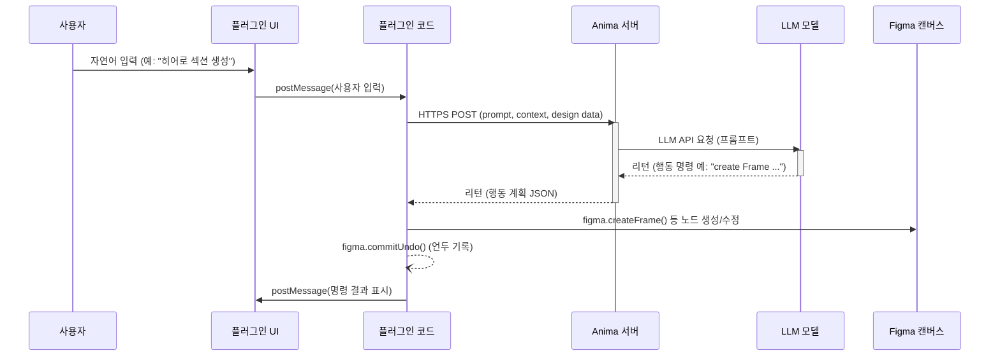

# Buddy – Figma AI 디자인 에이전트: 기술 분석

> 주의: 이 문서는 공개 자료를 바탕으로 한 넓은 기술 분석 메모입니다.
> 공식 출처로 직접 확인된 사실도 포함되어 있지만, `백엔드 구조`, `통신 프로토콜`, `보안 토큰`, `캐싱`, `옵티미스틱 UI`, `델타 업데이트` 같은 항목은 상당 부분 합리적 추정입니다.
> 따라서 이 문서는 Buddy의 내부 구현 설명서라기보다, xbridge 설계 아이디어를 넓게 검토하는 참고 문서로 사용하는 것이 안전합니다.

**요약:** Buddy는 Anima에서 개발한 Figma 플러그인으로, Figma 캔버스 안에서 자연어로 명령하여 UI를 자동 생성·편집할 수 있는 AI 도우미입니다. 사용자는 채팅창에 지시를 입력하면, 플러그인 코드가 Figma 플러그인 API를 통해 현재 파일의 프레임, 컴포넌트, 스타일, 변수 등의 정보를 읽어 서버로 전송합니다. 서버(Anima 백엔드)는 OpenAI/Anthropic 등 대형 AI 모델을 호출해 명령을 처리한 후, 생성할 노드나 수정사항을 리턴합니다. 플러그인은 이를 받아 `figma.createFrame()`, `figma.createText()`, `figma.importComponentByKeyAsync()` 등 Figma API 메서드를 이용해 캔버스에 노드를 생성하거나 변경합니다【65†L147-L150】【65†L194-L198】. 이 과정은 표준 Figma 작업처럼 언두 스택에 기록되어(`figma.commitUndo()` 사용) 언제든 되돌릴 수 있습니다【65†L295-L298】. Buddy는 별도 설정 없이 설치만으로 작동하며, 여러 AI 모델 선택(예: GPT-4, Claude 등)이 가능합니다【65†L275-L278】. 이 보고서에서는 Buddy의 핵심 구성요소와 아키텍처, 사용된 Figma 플러그인 API, 네트워크·통신 방법, AI 모델 통합, 보안·인증, 성능 최적화, 실패 모드 등을 기술적으로 분석합니다.  

## 구성요소 및 아키텍처  
Buddy 플러그인은 크게 **Figma 클라이언트(플러그인 UI/코드)**와 **Anima 백엔드 서비스**로 구성됩니다. 사용자 인터페이스(UI)는 Figma 플러그인 패널 내의 채팅 창으로 구현되어 있으며(Figma 플러그인 UI), 입력된 자연어 명령을 서버에 전달합니다. 플러그인 코드는 TypeScript로 작성되어 있으며, Figma의 `figma.ui.postMessage()`/`figma.on('message')` 시스템으로 UI ↔ 플러그인 간 통신을 합니다. 백엔드는 Anima의 AI 에이전트 서버로, 내부적으로 OpenAI나 Anthropic(Claude) 등의 LLM API를 호출하는 마이크로서비스 구조일 것으로 추정됩니다【65†L275-L278】. 예를 들어, 사용자가 “새로운 히어로 섹션을 디자인해줘”라고 입력하면, UI→플러그인 코드→HTTPS 요청(혹은 WebSocket/SSE)으로 백엔드에 전달되고, 백엔드는 LLM으로부터 받은 **행동 명령(action instructions)** 을 플러그인에 전송합니다. 플러그인은 이를 받아 Figma 노드를 생성・편집하고 레이어를 재정렬합니다【65†L194-L198】.  

- **플러그인 UI:** React/HTML 기반 채팅 인터페이스. 메시지 입력, AI 응답 출력, 설정(모델 선택, 디자인 시스템 가져오기) 등을 처리합니다.  
- **플러그인 코드:** Figma 환경에서 동작하는 TypeScript 코드. `figma.*` API로 파일 내용을 읽고, 노드를 생성/수정합니다. 내부 상태는 `figma.clientStorage` 등에 저장될 수 있습니다.  
- **백엔드 서비스:** Anima의 AI 에이전트 서버. 사용자의 문장과 디자인 컨텍스트(컴포넌트, 변수 등)를 받아 프롬프트를 생성하고 LLM에 질의한 뒤 행동 계획(action plan)을 리턴합니다. 또한 “웹페이지 URL을 붙여넣기” 기능은 URL을 받아 HTML/CSS를 파싱한 후 Figma 레이어로 변환해줍니다(외부 서비스 가능).  
- **AI 모델:** OpenAI GPT, Anthropic Claude 등 여러 모델과 연결 가능합니다【65†L275-L278】. 모델 호출은 RESTful API(HTTPS) 혹은 스트리밍(SSE/웹소켓) 방식으로 이루어지며, 프롬프트 토크나이즈 및 LLM 응답 스트리밍을 지원합니다.  

【66†embed_image】 *그림 1. Buddy 플러그인 예시: 좌측은 채팅 기반 UI로 사용자가 명령을 입력하고, 우측 “Your Design System” 전환 버튼으로 디자인 시스템 사용을 켜거나 끌 수 있다. Buddy는 디자인 시스템 가져오기 기능을 통해 실제 컴포넌트/스타일을 우선 사용【65†L147-L150】【65†L194-L198】한다.*

위 시퀀스에서 알 수 있듯, Buddy는 Figma 플러그인 API와 자체 백엔드 사이를 중계합니다. Figma 플러그인에서 서버로의 인증(예: OAuth) 과정은 공식 문서에 특별 언급이 없으므로, 대개 별도 로그인이 필요 없는 방식으로 구현된 것으로 추정됩니다. 즉, 사용자는 플러그인 설치만으로 바로 이용 가능하며【65†L166-L170】, 내부적으로는 TLS 암호화된 HTTPS 트래픽으로 통신하여 보안이 유지됩니다. 다중 병렬 채팅(Parallel Chats) 기능【13†L86-L94】은 클라이언트 측에서 각기 독립적인 세션을 관리하며, 각 세션마다 별도의 LLM 요청을 보낼 수 있음을 의미합니다. 

## Figma 플러그인 API 활용  
Buddy가 Figma 캔버스를 읽고 쓰기 위해 사용하는 주요 플러그인 API 메서드를 정리하면 다음과 같습니다. 이 메서드들은 공식 Figma 플러그인 개발자 문서와 커뮤니티 포럼에서 지원 사실이 확인됩니다.

- **디자인 시스템 읽기:** `figma.getLocalPaintStyles()`, `figma.getLocalTextStyles()`, `figma.getLocalEffectStyles()`, `figma.getLocalGridStyles()` 등으로 현재 파일의 로컬 스타일(컬러, 텍스트, 이펙트, 그리드)을 가져옵니다【37†L61-L63】. `figma.getLocalVariablesAsync()`로 디자인 토큰(색상, 치수 변수 등)도 불러옵니다【35†L129-L137】. 로컬 컴포넌트는 별도의 API가 없어 `figma.currentPage.findAll(node => node.type==='COMPONENT')`로 찾아야 합니다【49†L1-L4】. 라이브러리 컴포넌트나 스타일은 `figma.importComponentByKeyAsync(key)`, `figma.importComponentSetByKeyAsync(key)`, `figma.importStyleByKeyAsync(key)` 등을 통해 가져올 수 있습니다【43†L179-L185】【46†L1-L4】. 이를 통해 사용자가 가진 팀 라이브러리나 디자인 시스템을 Buddy가 불러와 활용합니다.

- **프레임/노드 생성:** `figma.createFrame()`【32†L119-L127】, `figma.createComponent()` 등으로 새 프레임이나 컴포넌트를 만들고, 필요시 `.clone()`으로 기존 노드를 복제합니다. 텍스트는 `figma.createText()`로 노드를 만든 뒤, `await figma.loadFontAsync(text.fontName)`으로 폰트를 로드하고 `text.characters = 'Hello'`처럼 내용을 입력합니다【64†L139-L142】. 이미지나 캔버스 요소는 `figma.createImageAsync()`와 같은 메서드로 삽입합니다. 또한 `figma.group(nodes, parent)`이나 `node.appendChild(child)` 등을 써서 레이어를 그룹화하거나 자식 노드를 추가합니다.

- **속성/스타일 설정:** 생성된 노드의 속성(크기, 위치, 색상, Auto Layout 등)을 설정합니다. 예를 들어 `node.layoutMode = 'VERTICAL'`로 Auto Layout을 적용하거나, `node.primaryAxisAlignContent = 'SPACE_BETWEEN'` 등으로 정렬을 지정합니다. 텍스트 노드는 `fontSize`, `fills`(색상) 등을 설정하고, 버튼 등 컴포넌트는 `button.setProperties({ /* variants */ })`로 변형을 조정할 수 있습니다.

- **파일 선택 및 스크롤:** 사용자가 선택한 프레임이나 레이어에 대한 컨텍스트는 `figma.currentPage.selection`을 통해 확인합니다. Buddy 사용 예시처럼 “선택한 화면에서 작업하기” 기능의 경우, 이 선택 목록을 `findOne`/`findAll`로 참조하여 해당 노드의 내용을 백엔드에 보낼 수 있습니다. 필요시 `figma.viewport.scrollAndZoomIntoView(nodes)`로 뷰포트를 조정할 수 있습니다.

- **댓글/이벤트:** Buddy는 공식 문서에서 Figma 댓글(Comment) 기능을 직접 활용하지 않는 것으로 보입니다(제공된 자료에 언급 없음). 다만, 의견 기록이 필요하면 `figma.createComment()` 같은 메서드를 사용할 수 있습니다.

이와 같은 메서드 활용은 Figma 플러그인 개발자 가이드에도 잘 정리되어 있습니다. 예를 들어, `figma.createText()` 사용법 문서에서는 폰트 로드 후 텍스트를 설정하는 예제를 보여줍니다【64†L139-L142】. 디자인 시스템 수집을 위해 `figma.getLocalPaintStyles()` 등도 공식 업데이트 블로그에 소개되었습니다【37†L61-L63】. 컴포넌트는 `key`를 이용해 가져오도록 안내되어 있으며【43†L179-L185】, 실제 구현 시 `await figma.importComponentByKeyAsync(key)` 같은 비동기 호출이 필요합니다. 

| 기능            | 예시 Figma API 메서드                          |
|---------------|------------------------------------------|
| 로컬 스타일 읽기   | `figma.getLocalPaintStyles()`, `getLocalTextStyles()`, `getLocalEffectStyles()`, `getLocalGridStyles()`【37†L61-L63】 |
| 로컬 변수 읽기    | `await figma.getLocalVariablesAsync()`【35†L129-L137】     |
| 컴포넌트/스타일 가져오기 | `await figma.importComponentByKeyAsync(key)`, `importComponentSetByKeyAsync(key)`, `importStyleByKeyAsync(key)`【43†L179-L185】 |
| 노드 생성        | `figma.createFrame()`, `figma.createText()`, `figma.createImageAsync()`, `figma.group()` 등 |
| 텍스트 설정      | `await figma.loadFontAsync(text.fontName); text.characters = '...'`【64†L139-L142】 |
| Auto Layout 지정 | `frame.layoutMode = 'HORIZONTAL'|'VERTICAL'`; `frame.primaryAxisAlignContent = 'CENTER'`, 등 |
| 레이어 트리 조작   | `parent.appendChild(child)`, `figma.flatten(nodes)`, `figma.commitUndo()` 등 |

**테이블:** Buddy 플러그인이 활용할 것으로 보이는 주요 Figma 플러그인 API 메서드 예【37†L61-L63】【43†L179-L185】.

## 네트워크 및 통신 방식  
Buddy는 외부 AI 서비스와의 통신을 위해 안전한 네트워크 채널을 사용합니다. 일반적으로 Figma 플러그인 환경에서는 `fetch` 또는 WebSocket API를 사용할 수 있습니다【32†L103-L105】. Buddy가 자연어 처리 요청을 보낼 때는 **HTTPS POST** 요청(HTTP/1.1 혹은 HTTP/2)을 사용하여 Anima 백엔드에 프롬프트와 컨텍스트(파일 키, 노드 정보 등)를 전송할 것으로 예상됩니다. 서버의 응답은 **Streaming** 방식으로 처리해 사용자 경험을 빠르게 합니다. 예를 들어, OpenAI의 ChatCompletion API 스트리밍(서버-센트 이벤트, SSE)이나 WebSocket을 이용해 토큰 단위로 결과를 받으면 UI에 점진적으로 표시할 수 있습니다. 이는 채팅 응답 속도를 높이고 사용자가 결과를 기다리는 동안 중간 피드백을 제공해줍니다.  

네트워크 안정성을 위해 요청 실패 시 **재시도(backoff)** 로직을 둘 수 있습니다. 예를 들어, 서버 응답 지연이나 타임아웃이 발생하면 지수 백오프를 적용해 재요청하며, 일정 횟수 초과 시 사용자에게 오류 메시지를 보냅니다. Anima의 MCP 가이드에서처럼 긴 작업에는 10분 타임아웃 권장【16†L21-L30】되며, 이를 플러그인 코드에 반영할 수 있습니다. 대량 작업(예: HTML→Figma 변환)은 서버에서 처리 시간(수분 단위)을 요구할 수 있어, 이 경우에는 플러그인이 비동기 진행 상태를 표시해야 합니다.

동시성(concurrency)을 고려하면, Buddy는 **병렬 대화(Parallel Chats)** 기능을 지원합니다【13†L86-L94】. 즉, 사용자는 여러 개의 채팅 스레드를 동시에 열어 각기 다른 작업을 수행할 수 있습니다. 플러그인 코드는 각 채팅 세션마다 별도의 요청을 백엔드로 보내며, 이를 동시 처리합니다. 이때 플러그인은 Promise와 async/await를 적절히 사용해 여러 API 호출을 동시에 처리하되, Figma API 호출 시 동기화 문제(예: 동일 레이어를 동시에 수정)에는 주의해야 합니다.

속도와 효율을 위해 요청을 **배치(batch)** 처리할 수도 있습니다. 예를 들어, 여러 개의 노드를 한꺼번에 생성하거나 업데이트할 때 HTTP 요청을 묶어 보내거나, 파일 시스템 I/O 작업을 최소화할 수 있습니다. Figma 플러그인 API 자체는 대개 동기 호출이지만, 여러 노드를 순차적으로 삽입하는 대신 배열 단위로 추가(예: `figma.group([...nodes], parent)`)하면 레이어 수정을 한 번에 할 수 있습니다.

또한 **캐싱** 전략도 중요합니다. Buddy는 이미 불러온 디자인 시스템 정보(스타일 목록, 컴포넌트 이름 등)를 클라이언트나 메모리에 저장해 반복적인 네트워크 호출을 줄일 수 있습니다. 예를 들어, `figma.getLocalPaintStyles()` 결과를 저장해 두고 새 요청 시 기존 목록을 활용하면 API 호출량을 절감할 수 있습니다. 이미지나 웹페이지 데이터를 변환할 때도, 한번 가져온 URL/HTML 결과는 일정 기간 캐시해두면 재요청을 줄일 수 있습니다.  

| 통신 방식    | 장점                                | 단점                            |
|------------|-----------------------------------|-------------------------------|
| **HTTPS (Fetch)** | 쉬운 구현, SSL/TLS 암호화, HTTP/2 지원 가능 | 요청-응답 지연 있음, 페이로드 크기 제한 |
| **Server-Sent Events (SSE)** | 서버→클라이언트 스트리밍 지원, 구현 간편 | 단방향(서버→클라이언트)만 가능 |
| **WebSocket** | 양방향 실시간 통신, 낮은 지연, 스트리밍에 적합 | 복잡도 증가, 서버 자원 부담, WSS 필수 |

**테이블:** Buddy에서 사용할 수 있는 통신 프로토콜 비교. 예를 들어, HTTP는 구현이 간단하고 안전하나 실시간 스트리밍에는 한계가 있으며, SSE/WebSocket은 스트리밍 처리에 유리하지만 복잡성과 자원 부담이 있다.  

## 대형 AI 모델 통합  
Buddy는 자체 모델을 실행하지 않고 클라우드 기반 AI 서비스에 의존할 것으로 보입니다. 공식 문서에 “여러 AI 모델 지원”이 언급된 것을 보면【65†L275-L278】, OpenAI (GPT-4, GPT-3.5), Anthropic Claude 등 복수의 모델을 사용할 수 있으며, 사용자는 설정에서 모델을 선택할 수 있습니다. 각 모델 호출은 해당 API를 통해 이루어지며, 비용과 응답속도, 성능(프롬프트 처리 능력)에 따라 적절히 선택할 수 있습니다. 자체 호스팅 모델(예: on-device Llama나 미니 모델) 가능성은 희박하며, 대부분의 워크로드는 서버 측에서 처리됩니다. 

프롬프트엔지니어링은 백엔드 단계에서 이뤄집니다. Buddy는 “당신은 Figma 플러그인이다” 같은 시스템 프롬프트로 시작해, 사용자의 명령과 디자인 컨텍스트(예: “이 캔버스에 있는 컴포넌트와 변수 목록”)를 조합하여 LLM에 보냅니다. 생성된 답변은 단순한 텍스트가 아니라 **행동 계획(action plan)** 형태여야 하며, 백엔드에서 JSON 등으로 파싱하여 플러그인에 전달합니다. 토큰 단위로 응답을 받기 위해 OpenAI의 스트리밍 API나 Anthropic의 스트림 기능을 활용할 수 있으며, 플러그인은 이 스트림을 받아 화면에 출력하거나 점진적으로 노드를 생성합니다. 예를 들어, “새 카드 컴포넌트를 만들어줘” 요청 후 “요청 처리 중…” 같은 상태 메시지를 UI에 표시할 수 있습니다.  

토크나이제이션(tokenization)은 주로 LLM 쪽에서 이뤄지지만, 플러그인은 메시지 길이를 관리하기 위해 사용자 입력을 요약하거나 필터링할 수 있습니다. 긴 디자인 정보를 효율적으로 전달하기 위해, 플러그인은 선택된 노드의 메타데이터(예: 컴포넌트 이름, 크기, 배치만 간략한 문장으로)만 보내고, 실제 레이어 구조는 Figma에서 그대로 유지하도록 할 수 있습니다.

## 보안 및 인증  
Buddy 플러그인은 사용자의 Figma 데이터에 접근하기 때문에 권한 관리가 필요합니다. 공식 문서에 “추가 설정이나 API 키 불필요”라는 점【65†L166-L170】이 명시되어 있듯, 사용자는 플러그인 설치만으로 바로 이용 가능합니다. 이는 Buddy가 자체적으로 OAuth 인증을 요구하지 않음을 의미합니다. 다만, 백엔드와 통신할 때는 애플리케이션 수준에서 API 키나 토큰을 사용할 수 있습니다. 예를 들어, Anima 서버는 OpenAI API 키를 서버 측에서 관리하며, 플러그인은 익명 사용자로 요청을 보낼 수 있습니다.

통신은 HTTPS를 사용해 암호화되며, 사용자 데이터는 암호화 채널로 전송됩니다. 가능한 경우 적은 권한 원칙을 적용해, 플러그인은 읽기-쓰기 권한만으로 작동하도록 되어 있을 것입니다. Figma 플러그인의 `manifest.json`에는 보통 `"editorType": ["figma"]`와 `"permissions": ["currentuser"]` 등이 명시됩니다. Buddy는 캔버스 수정이 주목적이므로 `allowFullFileAccess`가 필요할 수 있으며, 이 경우 Figma가 제공하는 OAuth 흐름으로 사용자 인증을 수행했을 수 있습니다(공식 언급은 없음).

클라이언트와 서버 간 인증 토큰은 일반적으로 짧은 수명(예: JWT)으로 관리하거나, Figma의 사용자 세션과 연동된 임시 키를 사용할 수 있습니다. 민감 정보를 다루지 않고, 명령과 디자인 데이터만 주고받기 때문에 추가 암호화(예: 엔드투엔드 암호화)는 불필요하며, 전송 계층의 TLS로 보호됩니다. 

## 성능 최적화  
Buddy는 실시간 반응성이 중요한 플러그인이므로 다양한 최적화 기법을 사용할 수 있습니다. 먼저 **델타 업데이트(delta update)** 전략으로 변경된 부분만 갱신합니다. 예를 들어, 사용자가 “레이아웃 가운데 정렬”만 요청하면 플러그인은 관련된 프레임 노드 속성만 수정하고, 나머지 노드는 그대로 둡니다. 변경 전후 캔버스 상태를 비교(diff)하여 최소한의 작업만 수행함으로써 효율을 높일 수 있습니다.

또한 플러그인 내부적으로 **로컬 캐시**를 활용합니다. 이미 로드한 폰트나 컴포넌트, 스타일 정보는 캐시에 저장해두어 반복 호출을 방지합니다. 예를 들어, `await figma.loadFontAsync()`는 한 번 로드한 폰트에 대해서는 다음 호출 시 즉시 사용되므로, Buddy는 필요시만 폰트를 로드하도록 설계됩니다【64†L139-L142】. 디자인 시스템 설정도 한 번만 가져오고 이후 대화에서는 재사용합니다.

**비동기 처리(async)** 도플로팅을 활용해 UI 응답 속도를 개선합니다. 백엔드 호출과 Figma API 작업을 `async/await`로 처리하면서, UI는 로딩 인디케이터를 보여주거나 부분 결과를 출력하여 사용자가 대기 시간을 체감하지 않도록 합니다. 복잡한 계산이나 트랜스폼은 워커(Worker)가 아닌, Figma 플러그인 자체의 JS 이벤트 루프와 브라우저 환경에 의존하지만, 꼭 필요한 경우에는 Web Worker를 플러그인 UI에서 사용하여 연산을 분산시킬 수 있습니다.

마지막으로, **옵티미스틱 UI**도 고려할 수 있습니다. 즉, 백엔드 응답을 기다리는 동안 “완료 단계”로 빠르게 전환하거나 이전 응답을 재사용하는 방식입니다. 예를 들어, 사용자가 유사한 명령(“버튼 색상을 파란색으로 바꿔줘”)을 반복하면, 플러그인은 이미 처리된 패턴을 기억해 즉시 적용할 수 있습니다. 물론, 결국 정확한 결과는 서버 응답 후 반영해야 하므로, 이 경우에는 결과가 동일함을 보장하는 프로세스가 필요합니다. 

## 실패 모드 및 대응  
Buddy 사용 중 예외 상황(네트워크 오류, AI 응답 실패 등)이 발생할 수 있습니다. 이러한 실패에 대비해 다음과 같은 대응이 필요합니다. 먼저, 모든 플러그인 액션은 Figma의 언두 스택에 기록됩니다【65†L295-L298】. 따라서 잘못된 명령이 실행되더라도 **Cmd/Ctrl+Z**로 손쉽게 되돌릴 수 있어 사용자는 걱정 없이 시도할 수 있습니다. 예를 들어, “레이어를 무한루프 생성” 같은 이상한 지시가 내려와도 언두로 복구 가능합니다.

서버 호출이 실패하면 (예: timeout, 인증 실패), 플러그인은 `figma.notify()`로 사용자에게 오류를 알리거나 UI에 오류 메시지를 표시해야 합니다. 재시도 로직은 백엔드가 일시적으로 과부하일 때 유용하며, 필요시 사용자가 “다시 시도” 버튼을 누를 수 있도록 합니다. Buddy가 멀티채팅을 지원하므로, 한 대화 스레드에서 오류가 나더라도 다른 스레드는 영향을 받지 않아야 합니다.

권한 문제로 특정 컴포넌트/라이브러리를 불러오지 못할 때는, 플러그인이 이를 캐치해 “라이브러리에 접근 권한이 없습니다”와 같은 메시지를 보여주고 명령을 취소합니다. 디자인 시스템 가져오기 실패 시에도 비슷하게 안내해야 합니다. 

기타 실패 모드로는 **모델 한계**가 있습니다. LLM이 복잡한 명령을 잘못 해석하거나, 의도를 벗어난 결과를 생성할 수 있습니다. 이때 사용자에게 명확한 재질문 옵션("명령이 정확히 이해되지 않았습니다")을 제공하거나, Buddy 자체 로그에서 “이 명령을 처리할 수 없습니다” 같은 안내를 해주면 됩니다.  

## 구현 옵션 및 비교  
아키텍처 구성이나 통신 방식에 따라 다양한 구현 옵션이 있을 수 있으며, 각 옵션의 장단점은 다음 표와 같습니다.

| 항목       | 옵션              | 장점                                                          | 단점                                                        |
|----------|-----------------|-------------------------------------------------------------|-----------------------------------------------------------|
| 전송 프로토콜  | HTTP/HTTPS (Polling)  | 구현 단순, 모든 환경 지원, TLS 암호화                           | 실시간 반응 한계, 지속 연결 불가                              |
|          | Server-Sent Events | 서버→클라이언트 스트리밍, 구현 비교적 간단                           | 클라이언트→서버는 별도 요청 필요, 양방향 어려움                 |
|          | WebSocket       | 양방향 실시간 통신, 양방향 스트리밍 가능                         | 서버 자원 필요, SSL(WSS) 필수, 구현 복잡                     |
| LLM 제공처   | OpenAI GPT-4/3.5   | 강력한 성능, 정확도 높음, OpenAI 생태계 활용                       | 비용 부담(요금제), API 호출량 제한, 고정 모델                    |
|          | Anthropic Claude | 잘 설계된 대화 모델, 때때로 비용(OpenAI 대비) 저렴, 긴 컨텍스트 처리 우수 | API 지원 범위 제한적, 응답 속도(GPU), 특정 기업 접근 제한 가능         |
|          | 자체 호스팅 LLM   | 데이터 프라이버시 확보, API 의존도 없음, 커스터마이즈 자유로움         | 서버 유지비용(강력 GPU 필요), 성능(OpenAI 대비 낮음 가능성), 개발 부담 증가 |
| 디자인 시스템 | 로컬만 사용        | 간단, 즉시 접근 가능, 별도 인증 불필요                          | 팀 라이브러리나 공동 작업 반영 어려움                           |
|          | 라이브러리 연동     | 팀 전체 일관성 유지, 최신 컴포넌트 자동 반영                         | Figma 권한 필요, `import` 실패 가능                           |

**테이블:** 구현 선택지와 그에 따른 장단점 비교. 예를 들어, WebSocket을 쓰면 양방향 실시간 통신이 가능하지만 구현 복잡도와 서버 부담이 증가합니다. LLM 제공처는 각각 비용, 성능, 보안 측면의 트레이드오프가 있습니다.  

## 테스트 및 검증 방법 제안  
Buddy 플러그인의 가설을 검증하기 위한 테스트/실험 방안은 다음과 같습니다:

- **네트워크 트래픽 캡처:** 플러그인이 실제로 서버와 주고받는 HTTP 요청/응답을 확인합니다. Figma 플러그인 자체에 개발자 도구를 열기는 어렵지만, 로컬 프록시(예: mitmproxy)나 네트워크 분석 툴을 사용해 TLS 암호화된 트래픽을 해독할 수 있습니다. 또는 프록시 설정 기능을 사용하거나, 플러그인 코드(소스를 얻었다면)에 `fetch`의 URL을 바꾸어 테스트 서버로 포워딩할 수 있습니다. 이를 통해 사용되는 엔드포인트, 헤더, 페이로드 형식을 파악합니다.

- **Figma REST API 검사:** Buddy가 내부적으로 Figma REST API를 호출하는지 확인할 수 있습니다. 예를 들어, 플러그인으로 파일을 열기 전에 개발자 콘솔에서 Figma Rest API 호출 로그를 모니터링하거나, 플러그인 실행 후 파일의 변경 내역(`GET /v1/files/:file_key`)을 비교해 봅니다. 필요한 경우 Figma API 토큰을 발급받아 플러그인 실행 전후 파일 상태를 스냅샷으로 저장합니다.

- **성능 테스트:** 동일한 명령을 여러 번 반복 실행하거나, 복잡한 디자인 변경 명령(예: “10개 이상의 컴포넌트 생성”)을 내려 처리 시간을 측정합니다. 병렬로 2개 이상의 채팅 세션을 동시에 돌려보고, 응답 지연이나 충돌이 없는지 확인합니다. 네트워크 지연을 시뮬레이션하여(`throttle` 기법), 응답 타임아웃과 에러 처리가 잘 되는지 테스트합니다.

- **장애 모드 시나리오:** 서버를 일부러 오프라인 상태로 둔 후 플러그인을 실행해봅니다. 네트워크 장애 시 사용자에게 오류가 표시되는지, 언두가 정상 작동하는지, 플러그인이 무한 로딩에 빠지지 않는지 점검합니다. 또한 권한 없는 라이브러리 접근을 시도하거나, 잘못된 명령(예: 무한 루프 의도)을 내렸을 때도 언두 및 오류 처리가 올바른지 확인합니다.

- **통신 방식 실험:** 플러그인 코드가 공개되었다면 HTTP 대신 WebSocket이나 SSE를 강제로 사용해 보거나, 또는 미구현된 WebSocket 기능이 있나 분석합니다. 모델 응답을 빠르게 받을 수 있는지, 스트리밍 표시가 잘 되는지, 실패 시 재연결이 되는지 확인합니다.

- **캔버스 변경 분석:** Buddy 사용 전후의 Figma 파일을 JSON으로 내보내어(diff/merge) 변경사항을 비교합니다. 어떤 노드가 추가/삭제/변경되었는지, 디자인 시스템 컴포넌트가 어떻게 활용되었는지 등을 확인할 수 있습니다. `figma.saveVersionHistoryAsync()` 기능을 이용해 변경 히스토리를 남기고, 변경 단계를 추적하는 것도 방법입니다.

이러한 테스트를 통해 Buddy의 설계 가설(예: API 사용, 스트리밍 방식, 성능 최적화)이 맞는지 검증할 수 있으며, 필요시 구현 방식을 조정할 근거를 얻을 수 있습니다. 

**참고 문헌:** Anima 공식 블로그 및 문서【65†L147-L150】【65†L194-L198】【65†L275-L278】, Figma 개발자 문서【37†L61-L63】【43†L179-L185】【64†L139-L142】, Figma 포럼 및 GitHub 자료【49†L1-L4】【16†L21-L29】 등을 참고하여 분석하였습니다.
